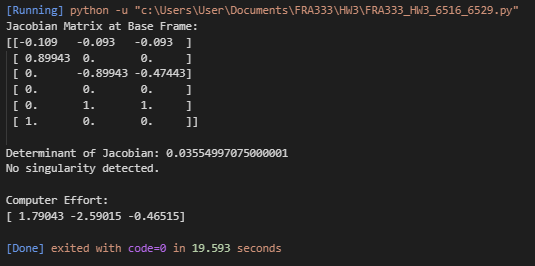
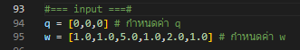
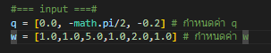
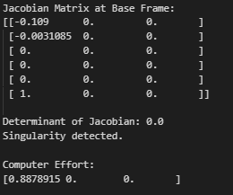
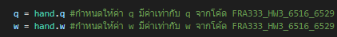
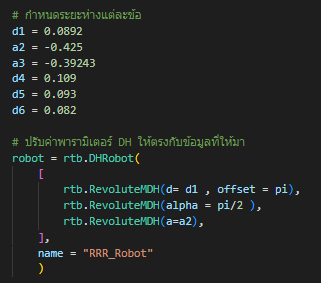
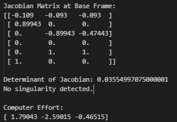
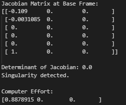

## **FRA333 HW3 จัดทำโดย**
1. ชัยภัทร 65340500016
2. ธรา 65340500029

## **โปรดลง Library พวกนี้ก่อนรัน**
  - numpy
  - math
  - roboticstoolbox

**ลงโดยใช้ Command พวกนี้**
```bash
  - pip install numpy==1.24.4
```
```bash
  - pip install math
```
```bash
  - pip install roboticstoolbox
```

**Clone project**

**ลงโดยใช้ Command นี้**
```bash
  gh repo clone Chaiyapat-Nilprapa/FRA333_HW3_6516_6529
```

**หลังจากเข้าไปเราจะใช้**

  1. FRA333_HW3_6516_6529.py >> ไฟล์คำตอบ
  2. testScript.py >> ไฟล์ตรวจคำตอบ
  3. HW3_utils.py >> Forward Kinematic function ที่โจทย์ให้มา

## **เมื่อรันไฟล์คำตอบ (FRA333_HW3_6516_6529.py)**

  Output ที่ได้ออกมา



  - เมทริกซ์ Jacobian ที่ได้จากการเทียบจาก Base
  - Det ของ Jacobian เพื่อใช้หา Singularity
  - จากภาพเนื่องจาก Det ของ Jacobian มีค่ามากกว่า 0.01 จึงไม่เกิด Singularity
  - Effort ที่เกิดขึ้น (ค่า Tau ที่แต่ละข้อต่อ)

  Input ที่ใส่เข้าไป
  
  

  เมื่อลองเปลี่ยน Input เป็น

  

  Output ที่ออกมาจะเป็นดังนี้

  
  
  - จากภาพเนื่องจาก Det ของ Jacobian มีค่าน้อยกว่า 0.01 จึงเกิด Singularity  

## **เมื่อรันไฟล์ตรวจคำตอบ (testScript.py)**
  
  **Input ที่ใส่**
  
  

  - เป็น Input ที่ดึงมาจาก ไฟล์คำตอบเพื่อให้ทั้งสองมี Input เหมือนกัน
  - เมื่อเปลี่ยน Input ที่ไฟล์คำตอบก็สามารถรันตรวจคำตอบต่อได่เลย

  **วิธีการตรวจ**
  ใช้ DH parameter และ Roboticstoolbox ในการตรวจ
 
  
  
  Output ที่ได้ออกมาจากครั้งที่ 1

  

  Output ที่ได้ออกมาจากครั้งที่ 2
 
  

  - จากทั้งสองภาพแสดงให้เห็นว่าคำตอบตรงกัน

## **Reference**
  https://petercorke.github.io/robotics-toolbox-python
  https://www.youtube.com/watch?v=pGPaLV35Mnk&list=PLHnZZE5j6C65J4-1t-azzmceXevAtWbRf

